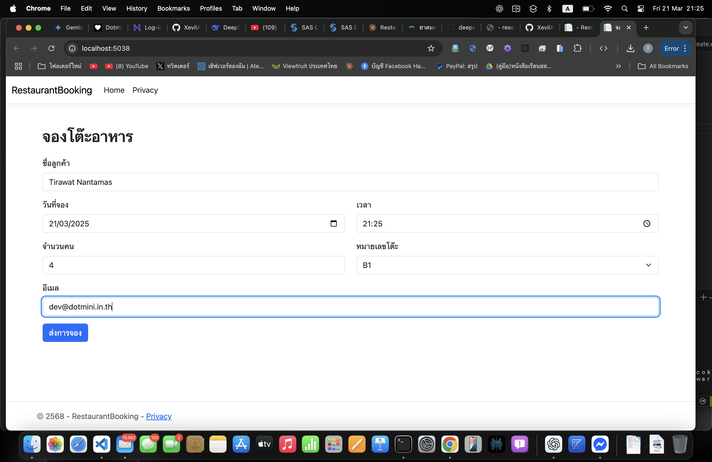
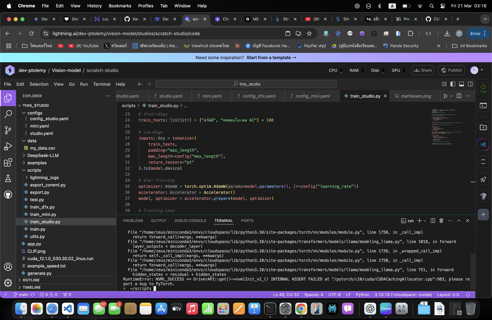

# 🚀 Tirawat Nantamas | Portfolio

## 👨‍💻 About Me
I'm **Tirawat Nantamas**, a passionate **Software Developer & UX/UI Designer** with experience in **web development, Linux, AI/ML, and modern UI frameworks**. I'm currently the ** Founder of Dotmini Software Project**.

- 🔭 Currently working on **AI, Linux, and modern UX/UI projects**
- 🎯 Interests: **Rust, Go, Python, Vala (GTK), and macOS-like UX/UI**
- 💡 Open to freelance and collaboration opportunities

📧 **Email:** [tirawatnantamas@gmail.com](mailto:tirawatnantamas@gmail.com)  
📧 **Work Email:** [dev@dotmini.in.th](mailto:dev@dotmini.in.th)  
📞 **Phone:** 064-223-0671

🐙 **GitHub:** [github.com/XevilA](https://github.com/XevilA)  

---

## 🔥 Featured Projects

### 1️⃣ **Dotmini DSS ML Kits**
📌 *A Teachable Machine-inspired web app using TensorFlow.js for custom AI models.*

🔗 [View Project](https://github.com/yourusername/dss-ml-kits)

---

### 2️⃣ **TyphoonAIChat (Vala + GTK4)**
📌 *A sleek AI chat app built with Vala, GTK4, and libadwaita.*

🔗 [View Project](https://github.com/yourusername/typhoon-ai-chat)

---

### 3️⃣ **WebApp with ASP.NET & ViteJS**
📌 *Modern web applications using ASP.NET backend and ViteJS for fast front-end development.*

🔗 [View Project](https://github.com/yourusername/webapp-aspnet-vitejs)

---

### 4️⃣ **AI Training & Language Models**
📌 *AI model training projects using Python, TensorFlow, and R for NLP and image recognition.*

🔗 [View Project](https://github.com/yourusername/ai-training-language)

---

## 🛠️ Tech Stack & Skills

**Languages:**  
  
  
  
  
  
  
  
  
  

**Frameworks & Tools:**  
  
  
  
  
  

📌 **Want to collaborate? Let's build something amazing!**  
💬 **Feel free to reach out!**
